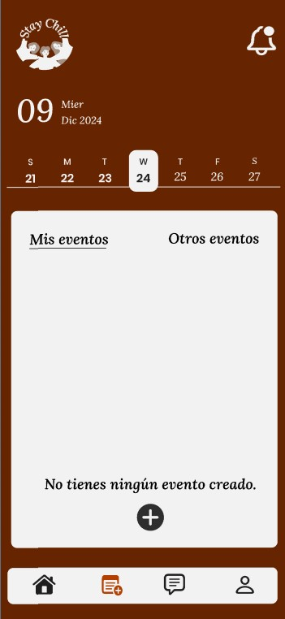

# Stay Chill

## Pantalla del Prototipo:

Concep art del diseño de la aplicacion:

  

## Integrantes
- **Alonso Gómez** - CM Cloud Master
- **Angel Castillo** - DS Designer
- **Konrad Drobnik** - SM Scrum Master

## Descripción General
**Stay Chill** es una aplicación móvil que invita a los usuarios a conocer nuevas personas cerca de ellos. A diferencia de otras apps para conocer gente (Tinder, Badoo, etc.), aquí las personas se presentan de manera física. 

La gente crea un evento, por ejemplo, ir a jugar un partido de baloncesto en las pistas del barrio, y desde la app el resto de usuarios puede buscar ese u otros eventos y autoinvitarse.

La aplicación busca que la gente se conozca como antiguamente, en persona, y no solo a través de chats. De esta manera, se crean relaciones o amistades más fuertes y directas.
