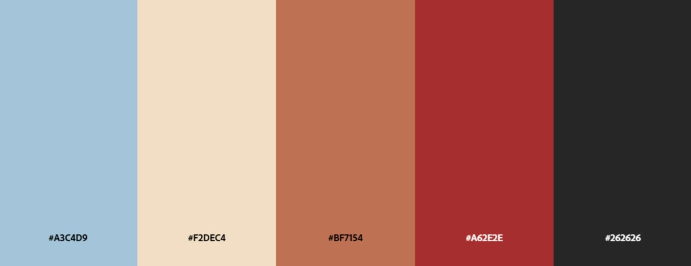
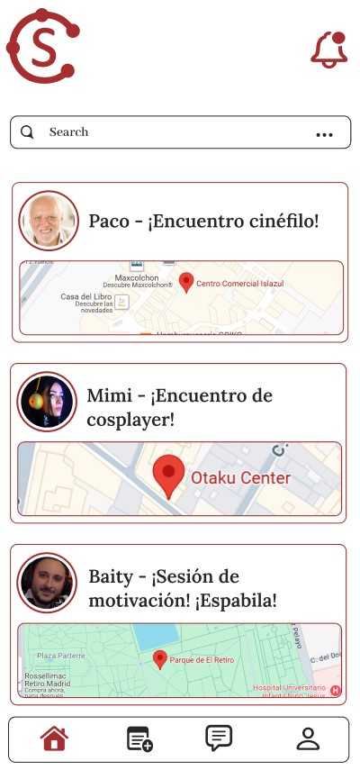
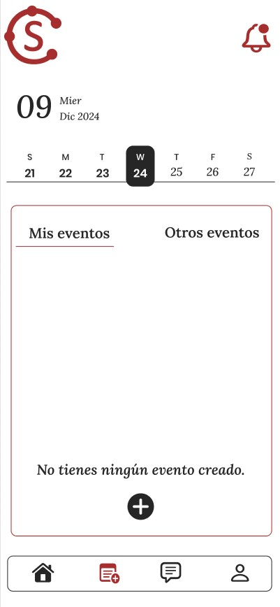
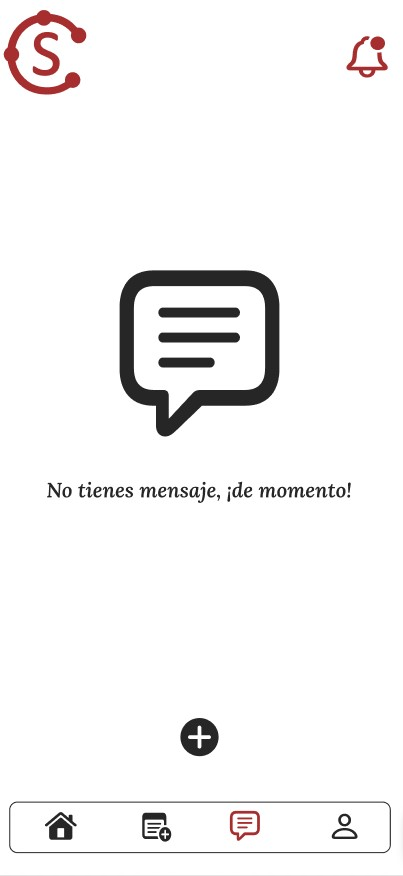
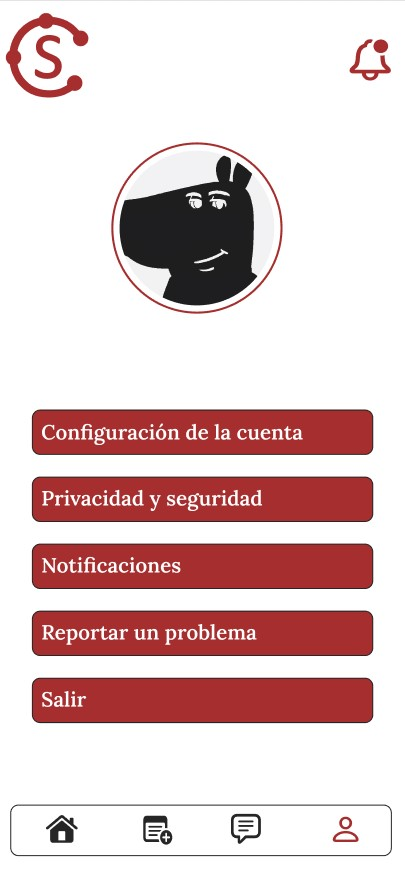

# STAY CHILL

  

Enlace a Figma: https://www.figma.com/design/KyVoo7Z4Q3HpOeT7HOTeMz/Stay-Chill?node-id=0-1&p=f&t=3dMJvDozEKVYZmZe-0

## Integrantes del proyecto:

- Alonso Gómez - CM Cloud Master
- Angel Castillo - DS Designer
- Konrad Drobnik - SM Scrum Master

## Descripción de la app:

Stay Chill se trata de una aplicación para móviles, que invita a los usuarios a conocer nuevas personas cerca de ellas.
La diferencia de otras apps para conocer gente (Tinder, Badoo, etc...) es que aquí las personas se presentan de manera física. La gente crea un evento, por ejemplo, ir a echar un partido de baloncesto en las pistas del barrio, y desde la app el resto de usuarios pueden buscar ese u otros eventos y autoinvitarse.

La app busca que la gente se conozca como antiguamente, en persona, y no escribiéndose por chat. De esa manera, se crean relaciones o amistades más fuertes y directas.

## Paleta de colores:

  

La paleta de colores fue seleccionada para transmitir confianza, calidez y dinamismo, reflejando la esencia de conectar personas a través de eventos. Los tonos combinan profesionalismo, cercanía y claridad visual, creando una experiencia atractiva y funcional que invita a la interacción.

## Pantallas.

Prototipos de las pantallas que tendrá la app.

### Página principal:

  

### Página de eventos:

  

### Página de mensajes:

  

### Página de configuración:

  

