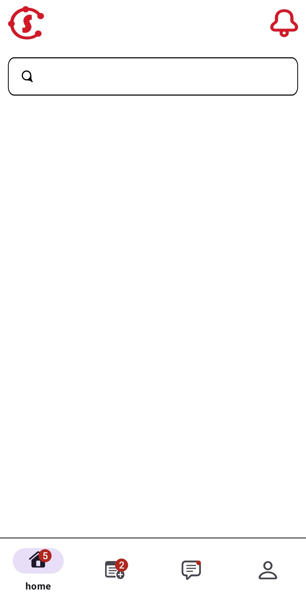
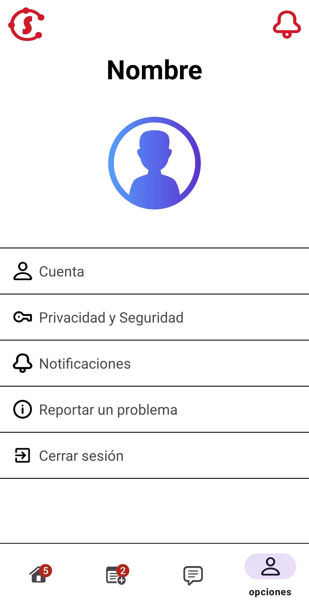

<h1> STAY CHILL </h1>

  

---

##  Enlaces de interés.

- Figma: https://www.figma.com/design/KyVoo7Z4Q3HpOeT7HOTeMz/Stay-Chill?node-id=0-1&p=f&t=3dMJvDozEKVYZmZe-0

- Trello : https://trello.com/b/efP3xoTZ/stay-chill

## Integrantes del proyecto:

- Angel Castillo - CM Cloud Master
- Konrad Drobnik - DS Designer
- Alonso Gómez - SM Scrum Master

## Descripción de la app:

Stay Chill se trata de una aplicación para móviles, que invita a los usuarios a conocer nuevas personas cerca de ellas.
La diferencia de otras apps para conocer gente (Tinder, Badoo, etc...) es que aquí las personas se presentan de manera física. La gente crea un evento, por ejemplo, ir a echar un partido de baloncesto en las pistas del barrio, y desde la app el resto de usuarios pueden buscar ese u otros eventos y autoinvitarse.

La app busca que la gente se conozca como antiguamente, en persona, y no escribiéndose por chat. De esa manera, se crean relaciones o amistades más fuertes y directas.

---

## Pantallas

### Splash:

Animación al entrar en la app.

  

### Login:

  

### Register:

  

### Página principal:

  

- Busqueda en el menú principal

  

- Barra de navegación

  

### Página de eventos (casi finalizada):

  

### Página de mensajes (aun en desarrollo):

  

### Página de configuración:

  

### Apartado de cuenta:

  

